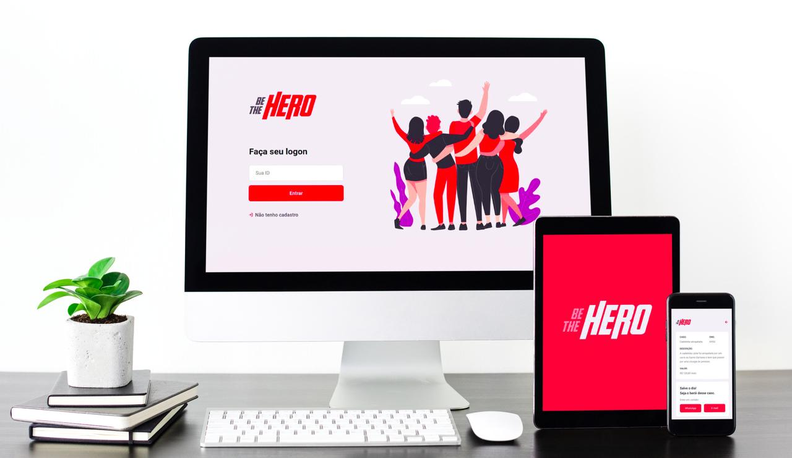

<h1 align="center">
    
</h1>

## 💻 Project

Be The Hero is a project that aims to connect people who are willing to help ONGs.

<h1 align="center">
    
</h1>

## :rocket: Technologies

This project was developed with the following technologies:

- [Node.js](https://nodejs.org/en/) 
- [React](https://reactjs.org)
- [React Native](https://facebook.github.io/react-native/)
- [Expo](https://expo.io/)

## :art: Layout

To access the layout use the tool [Figma](https://www.figma.com/file/2C2yvw7jsCOGmaNUDftX9n/Be-The-Hero---OmniStack-11?node-id=0%3A1).

## :notebook: Api Doc

You can access the api documentation [here](https://github.com/henriquecampaner/beahero/tree/master/mobile/).

## 🤝 Contributing

Contributions, issues and feature requests are welcome! Feel free to check [issues page](https://github.com/henriquecampaner/beahero).
- Make a fork;
- Create a branck with your feature: `git checkout -b my-feature`;
- Commit changes: `git commit -m 'feat: My new feature'`;
- Make a push to your branch: `git push origin my-feature`.

After merging your receipt request to done, you can delete a branch from yours.

## Show your support

Give a ⭐️ if this project helped you!

## :memo: License

This project is under the MIT license. See the [LICENSE](LICENSE.md) for details.

---

Made with ♥ by Henrique Campaner :wave: [Get in touch!](https://www.linkedin.com/in/henrique-campaner/)
